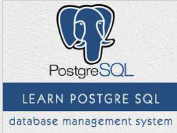

```
Roberto Nogueira  
BSd EE, MSd CE
Solution Integrator Experienced - Certified by Ericsson
```
# TutorialsPoint Postgresql



**About**

Learn everything you need to about the subject of this `Tutorialspoint` project.

[Homepage](https://www.tutorialspoint.com//postgresql/index.htm)

psql
## Topics
```
PostgreSQL Tutorial
[x] Home
[x] Overview
[x] Environment
[x] Syntax
[x] Data Types
[x] Create Database
[x] Select Database
[x] Drop Database
[x] Create Table
[x] Drop Table
[x] Schema
[x] Insert Query
[x] Select Query
[x] Operators
[x] Expressions
[x] Where Clause
[x] AND & OR Clauses
[x] Update Query
[x] Delete Query
[ ] Like Clause
[ ] Limit Clause
[ ] Order By
[ ] Group By
[ ] With Clause
[ ] Having Clause
[ ] Distinct Keyword
Advanced PostgreSQL
[ ] Constraints
[ ] Joins
[ ] Unions Clause
[ ] NULL Values
[ ] Alias Syntax
[ ] Triggers
[ ] Indexes
[ ] Alter Command
[ ] Truncate Table
[ ] Views
[ ] Transactions
[ ] Locks
[ ] Sub Queries
[ ] Autoincrement
[ ] Privileges
[ ] Date & Time
[ ] Functions
[ ] Useful Functions
PostgreSQL Interfaces
[ ] C/C++
[ ] Java
[ ] PHP
[ ] Perl
[ ] Python
PostgreSQL Useful Resources
[ ] Quick Guide
[ ] Useful Resources
[ ] Discussion
```
